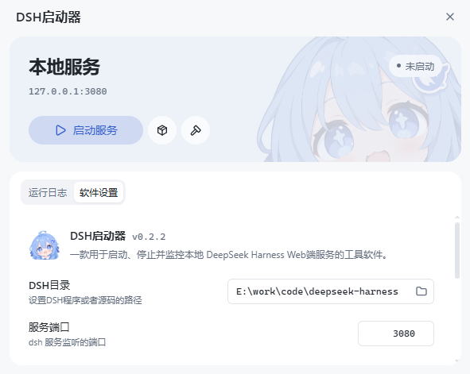

<p align="center">
  
</p>

<h1 align="center">DSH Web Launcher</h1>

<p align="center">
  A tiny desktop app that starts, stops, and watches your local
  <b>DeepSeek&nbsp;Harness</b> web server — one click, no terminal.
</p>

<p align="center">
  
  
  
  
  
  
  
</p>

<p align="center">
  <b>English</b> · <a href="README.zh.md">中文</a>
</p>

---

## 📖 What is this?

`dsh web` is the DeepSeek Harness local web server, normally started from a terminal with `pnpm dsh web`. **DSH Web Launcher** wraps that in a small desktop window, so you can manage the server, install dependencies, and build the frontend without touching the command line.

<p align="center">
  
</p>


## ✨ Features

- 🟢 **One-click lifecycle** — the main button adapts to state (Start → Open → Restart / Stop); Install and Build are available while the service is stopped.
- 🔌 **External-service aware** — a server started by another program on port `3080` can also be opened, restarted, or stopped (shown as *external*).
- 📜 **Unified live log** — backend, frontend, and IPC messages stream into one view; warnings and errors stay in the log (no dialogs or toasts), with Copy and Clear in the toolbar.
- ⚙️ **Persisted settings** — project directory, server port, theme, language, launch-at-startup (off by default), and stop-on-exit (on by default; stops the dsh service running on the configured port when the launcher quits).
- 🖥️ **System tray** — closing the window hides it to the tray; quit from there.
- 🌏 **Bilingual UI** — Simplified Chinese and English.

## 🏗️ Architecture

A thin **Rust core** (via [Tauri 2](https://tauri.app)) owns the server process and settings, while a **React + TypeScript** frontend renders the window and talks to it over Tauri's typed IPC. Vite and Tailwind CSS handle the frontend build and styling.

## 📂 Project structure

```text
apps/web/launcher/
├─ src/                    React frontend
│  ├─ components/          UI: status badge, controls, log viewer, settings
│  ├─ hooks/               Server-status polling, log stream, theme
│  ├─ i18n/                zh / en text dictionaries
│  └─ lib/tauri-api.ts     Typed wrappers over the Rust IPC commands
├─ src-tauri/              Rust backend (Tauri 2)
│  ├─ src/lib.rs           App setup, tray, window, IPC command handlers
│  ├─ src/process.rs       dsh-web lifecycle + process-tree termination
│  ├─ src/state.rs         Settings load/save, backend log strings (i18n)
│  ├─ bundle/*.iss         Inno Setup installer script
│  └─ Tauri.toml           Window, bundle, and security configuration
├─ scripts/                Packaging, icon generation, UI tests, maintenance
├─ public/                 App icons and images
├─ docs/                   Packaging guide and deep-dive notes
└─ package.json            Scripts and dependencies
```

## 🚀 Getting started

> Run everything inside `apps/web/launcher`. This is a **standalone npm project**
> — it is not part of the repository's pnpm workspace.

### 1. Prerequisites

- **Node.js** `^22.19` or `>=24`
- **Rust** (stable) + the platform build tools (MSVC on Windows) — required by Tauri
- **pnpm** on your `PATH` — the managed server runs via `pnpm dsh web`
- **Windows** with the Microsoft Edge **WebView2** runtime (preinstalled on Win 10/11)

### 2. Install & run

```bash
npm install          # install frontend dependencies
npm run tauri:dev    # launch the full app with hot reload
```

### 3. Build

```bash
npm run tauri:build  # compile a release build (and Tauri's MSI)
```

#### GNU Toolchain Build

For building with the GNU toolchain instead of MSVC (avoids MSVC dependencies):

```bash
# Prerequisites for GNU toolchain:
# - MinGW-w64 installed (provides x86_64-w64-mingw32-gcc)
# - Rust GNU target: rustup target add x86_64-pc-windows-gnu

npm run package:portable:gnu   # portable single-file exe with GNU toolchain
```

### Common commands

| Command | What it does |
| --- | --- |
| `npm run dev` | Frontend only, in a browser (no server control) |
| `npm run tauri:dev` | Full desktop app with hot reload |
| `npm run tauri:build` | Release build + Tauri MSI bundle |
| `npm run package` | Portable exe **and** Inno Setup installer (Windows) |
| `npm run test:ui` | Playwright UI checks |
| `npm run clean:port` | Free the dev port `5173` if it is stuck |
| `npm run icons` | Regenerate app icons from the master art (needs `sharp` from the workspace) |

## 📦 Packaging (Windows)

One command produces both deliverables into `release/`:

```bash
npm run package            # build once, then produce both
npm run package:portable   # portable single-file exe only
npm run package:installer  # Inno Setup installer only
npm run package:portable:gnu   # GNU toolchain portable exe
```

| Deliverable | Description |
| --- | --- |
| **Portable exe** | The Tauri binary itself — frontend and icons are embedded, so it runs directly: no install, no unpack, no folder. Needs only the system WebView2 runtime. |
| **Inno Setup installer** | Wraps the same exe and lets the user pick the install directory; installs per-user without elevation. Needs the Inno Setup compiler (`winget install JRSoftware.InnoSetup`). |

👉 See **[docs/packaging.md](docs/packaging.md)** for size tuning, options, and the WebView2 requirement.

## 🧪 Testing

With the launcher frontend running, run the UI checks:

```bash
npm run test:ui
```

- Reuses `apps/web`'s Playwright dependency and **simulates** Tauri responses — it does not run real install/build/start/stop operations.
- Windows uses installed Microsoft Edge; other platforms need Playwright Chromium.
- Set `LAUNCHER_TEST_URL` to target a different frontend URL.
- Screenshots are written to `dsh-launcher-ui` in the system temp directory.

## 💡 Notes & FAQ

- **Port** — `dsh web` listens on `http://127.0.0.1:3080` by default. If yours differs, set it in Settings → Server port so the launcher watches, opens, and stops the right one.
- **pnpm required** — service and dependency operations run `pnpm` in the DSH project root, so pnpm must be installed and on `PATH`.

## 📄 License

[MIT](https://opensource.org/licenses/MIT) © MonoStudio
